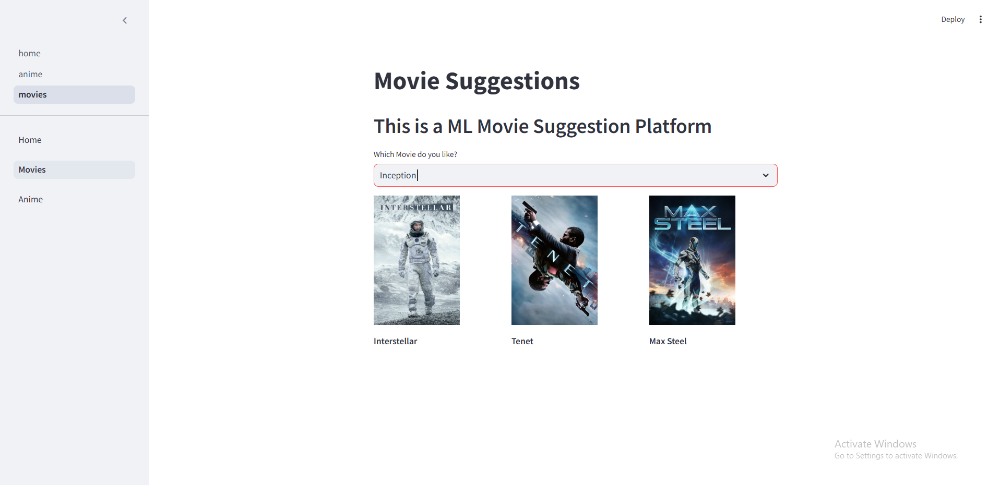
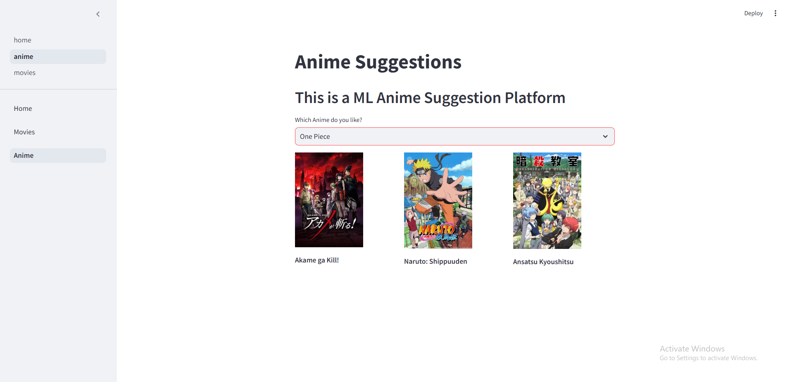

# 🎥 Movie & Anime Recommendation System 🎬

Welcome to the **Movie & Anime Recommendation System**! 🌟 This project leverages cutting-edge algorithms to provide personalized recommendations for your favorite movies and anime. Whether you're a cinephile 🎞️ or an otaku 🧝‍♂️, this system has got you covered!

---

## ✨ Features
- 🎭 **Personalized Movie Recommendations**: Tailored suggestions based on your preferences.
- 🎨 **Anime Recommendations**: Explore the best anime suited to your taste.
- 🤝 **User-Friendly Interface**: Built with Streamlit for an interactive and smooth experience.

---

## 🛠️ Tech Stack

- **Language:** Python 🐍
- **Framework:** Streamlit 🌐
- **Libraries:**
  - `Pandas` 📊
  - `NumPy` 🔢
  - `Scikit-learn` 🤖
  - `Streamlit` 🚀
- **APIs:** IMDb, Jikan (for anime data) 🌐

---

## 📥 Installation Instructions

Follow these steps to set up the project on your local machine:

1. **Clone the Repository** 🖥️:
   ```bash
   git clone https://github.com/your-username/recommendation-system.git
   cd recommendation-system
   ```

2. **Install Dependencies** 🛠️:
   Make sure you have Python installed, then run:
   ```bash
   pip install -r requirements.txt
   ```

3. **Run the Application** 🚀:
   Start the Streamlit app by running:
   ```bash
   streamlit run home.py
   ```

4. **Access the App** 🌐:
   Open your browser and go to: [http://localhost:8501](http://localhost:8501)

---

## 🚀 How to Use
1. Select your preference: Movies 🎥 or Anime 🐉.
2. Input your favorite title.
3. Get personalized recommendations instantly! 🪄

---

## 🌟 Screenshots

🎥 **Movie Recommendations:**


🐉 **Anime Recommendations:**


---

## 🤝 Contributing
We welcome contributions to make this project even better! 🛠️

1. Fork the repository 🍴.
2. Create a new branch for your feature/bug fix 🔧:
   ```bash
   git checkout -b feature-name
   ```
3. Commit your changes ✅:
   ```bash
   git commit -m "Add feature-name"
   ```
4. Push the changes 🔄:
   ```bash
   git push origin feature-name
   ```
5. Submit a Pull Request 🚀.

---

## 📜 License
This project is licensed under the [MIT License](LICENSE). Feel free to use, modify, and distribute it. 🌍

---

## 📧 Contact
Have questions or feedback? Reach out:
- Email: vijaybfriendly@gmail.com 📩
- GitHub: [My GitHub Profile](https://github.com/Vijay-Janarthanan) 💻

---

**Enjoy exploring your next favorite movie or anime!** 🎉🍿
